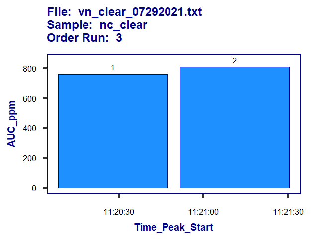
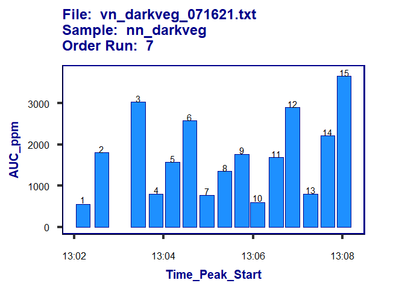
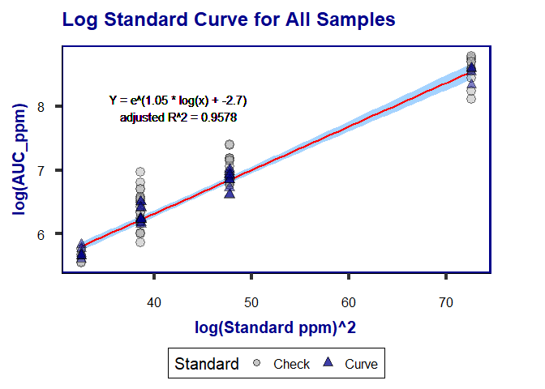
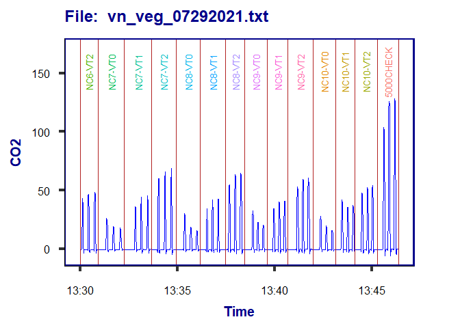

peak.gas Walkthrough
================
Jacob Anderson
12/12/2021

# Introduction

peak.gas is an R package developed as a useful tool in extrapolating gas
concentration data from text file output generated from benchtop
infrared gas analyzers(IRGA).

### Package functions

there are 2 processing functions that are included in peak.gas, each
processing function is accompanied by a plotting function

-   extract.peaks(cut.off = 2, method = “linear”, standard.sum = F,
    check.stand = F, check.alpha = .05, ci.meth = “avg”, verbose = F)

    -   plot(extract.peaks output, file = NULL, sample = NULL, std.curve
        = F, method = “linear”)

-   timeseries.peaks()

    -   plot(timeseries.peaks output, file, sample = NULL, time.start =
        NULL, time.stop = NULL)

# File formatting

The text file output should be formatted into 3 columns.

-   the first column should contain the time between samples starting at
    time zero as well as the sample names distinguished between dash
    marks (typically labeled as Etime),

-   the second column should be the datetime the sample was collected
    (typically labeled as Time),

-   and the third column should be the readings outpurt from the machine
    (in the case below labeled as CO2 (*μ**m**o**l*/*m**o**l*)). the
    sample name annotation should be included in the Etime column and
    distinguished by a series of dash marks. (see example below)

*Should your data look differently the code should be modified to
account for the change, or the data itself should be modified to match
the structure of the example below*

**Example of proper .txt file output generated using a LI-COR LI-8100A
IRGA**


# Install peak.gas

This function can be installed from the github repository
**andersonjake1988/peak.gas** by using the package `devtools` and the
following approach

``` package
library(devtools)
install_github('andersonjake1988/peak.gas')
library(peak.gas)
```

# Function usage guide

## extract.peaks(directory = choose.dir(), cut.off = 2, method = “linear” or “log”, standard.sum = F, check.stand = F, check.alpha = .05, ci.meth = “avg”, verbose = T)

### Description

extract.peaks() function will loop through a folder of text files
sharing identical formatting to combine and output a single dataframe
containing the columns:

1.  **File_Name:** The file name containing the data
2.  **Sample:** The sample annotations found within the file
3.  **Replicate:** The individual peaks found in each sample annotation
4.  **Order_run:** The numbered order that the sample was run in each
    file
5.  **AUC:** The sum of the area under the curve of each peak before
    standard calibration
6.  **Peak:** The maximum peak value recorded before standard
    calibration
7.  **Time_Peak_Start:** Datetime of the value recorded signalling the
    start of each peak
8.  **Time_Peak_Stop:** Datetime of the value recorded signalling the
    end of each peak
9.  **Timespan\_(s):** The duration of each peak
10. **AUC_ppm:** The sum of the area under the curve of each peak
    corrected using a standard calibration curve of known
    concentrations.


### Arguments of extract.peaks

-   **directory** The path to the directory (folder) that the function
    will process. Defaults to user selection window
-   **cut.off:** this argument sets the value to indicate the start and
    the end each peak. (essentially where to set the baseline of the
    peaks). Defaults to 2
-   **method:** this argument specifies whether to use a ‘linear’
    equation during the standard curve calibration or a ‘log’
    transformed equation. Defaults to “linear”
-   **standard.sum:** this argument specifies whether or not to output a
    table containing standard curve statistics along with the data
    output or not. Defaults to FALSE
-   **check.stand:** A logical argument stating whether or not to
    compare “check” standards to the standard curve. Defaults to FALSE
-   **check.alpha:** The value (0-1) to accept for check standard
    deviation, lower numbers indicate the confidence interval increases.
    Defaults to .05
-   **ci.meth** Argument to specify whether to compare average (“avg”)
    check standard AUC values, or individual (“indiv”) check standard
    AUC values. Defaults to “avg”
-   **verbose** A logical argument stating whether or not to display all
    function processing information. Defaults to TRUE

### Example of how to use function

``` r
# set the working directory to sample data
setwd(path.package("peak.gas"))

# run extract.peaks() function and store as object
output <- extract.peaks()
```

    ## [1] "Looping through Folder:"
    ##   |                                                                              |                                                                      |   0%  |                                                                              |==================                                                    |  25%  |                                                                              |===================================                                   |  50%  |                                                                              |====================================================                  |  75%  |                                                                              |======================================================================| 100%[1] "done"

``` r
# look at output
head(output)
```

    ## # A tibble: 6 x 10
    ##   File_Name           Sample   Replicate Order_Run   AUC  Peak Time_Peak_Start    
    ##   <chr>               <chr>    <chr>         <dbl> <dbl> <dbl> <dttm>             
    ## 1 vn_clear_071621.txt 300curve 1                 1  30.5 10.5  2021-07-16 11:32:07
    ## 2 vn_clear_071621.txt 300curve 2                 1  24.4  9.02 2021-07-16 11:32:51
    ## 3 vn_clear_071621.txt 300curve 3                 1  23.2  8.69 2021-07-16 11:33:19
    ## 4 vn_clear_071621.txt 500curve 1                 2  44.8 14.4  2021-07-16 11:34:25
    ## 5 vn_clear_071621.txt 500curve 2                 2  46.8 14.9  2021-07-16 11:35:18
    ## 6 vn_clear_071621.txt 500curve 3                 2  47.7 15.4  2021-07-16 11:36:03
    ## # ... with 3 more variables: Time_Peak_End <dttm>, Timespan_(s) <dbl>,
    ## #   AUC_ppm <dbl>

## plot(extract.peaks output, file = NULL, sample = NULL, std.curve = F, method = “linear”)

### Description

peak.gas provides a plotting framework for exploring the data output
from the extract.peaks() function

### Arguments of plot() call:

1.  **data:** the output from the extract.peaks() function
2.  **file:** select a specific file to plot. Defaults to NULL
3.  **sample:** select a specific sample to plot. Defaults to NULL
4.  **std.curve:** plot the standard curve data. Defaults to FALSE
5.  **method:** and option to plot the *linear* standard curve or the
    *log* standard curve. Defaults to ‘linear’

### Examples

``` r
# Pulls up a random plot from extract.peaks() output
plot(output)
```

<!-- -->

------------------------------------------------------------------------

``` r
# plots all samples called "NN_DARKVEG"
plot(output, sample = "NN_DARKVEG")
```

<!-- -->

------------------------------------------------------------------------

``` r
# plots all samples called "NN_DARKVEG" from file "vn_darkveg_071621.txt"
plot(output, file = "vn_darkveg_071621.txt", sample = "NC_DARKVEG")
```

<!-- -->

------------------------------------------------------------------------

``` r
# Plots the total linear standard curve using all files
plot(output, std.curve = T)
```

<!-- -->

------------------------------------------------------------------------

``` r
# Plots the total log transformed standard curve using all files
plot(output, std.curve = T, method = 'log')
```

<!-- -->

------------------------------------------------------------------------

``` r
# Plots the standard curve for the file "vn_clear_07292021.txt"
plot(output, file = "vn_clear_07292021.txt", std.curve = T)
```

<!-- -->

------------------------------------------------------------------------

## timeseries.peaks(directory = choose.dir(), verbose = T)

### Description

This is a simplified version of `extract.peaks()` this function will
transfer over the sample name and combine all the text files into a
single timeseries dataframe. *There are no arguments needed for this
function.*

### Arguments of timeseries.peaks

-   **directory** The path to the directory (folder) that the function
    will process. Defaults to user selection window
-   **verbose** A logical argument stating whether or not to display all
    function processing information. Defaults to TRUE

### Examples

``` r
setwd(path.package("peak.gas"))
test <- timeseries.peaks()
```

    ## [1] "Looping through Folder:"
    ##   |                                                                              |                                                                      |   0%  |                                                                              |==================                                                    |  25%  |                                                                              |===================================                                   |  50%  |                                                                              |====================================================                  |  75%  |                                                                              |======================================================================| 100%

``` r
head(test)
```

    ##                   File   Sample                Time   CO2
    ## 46 vn_clear_071621.txt 300curve 2021-07-16 11:31:44 -1.16
    ## 47 vn_clear_071621.txt 300curve 2021-07-16 11:31:45 -1.02
    ## 48 vn_clear_071621.txt 300curve 2021-07-16 11:31:46 -1.14
    ## 49 vn_clear_071621.txt 300curve 2021-07-16 11:31:47 -1.03
    ## 50 vn_clear_071621.txt 300curve 2021-07-16 11:31:48 -0.88
    ## 52 vn_clear_071621.txt 300curve 2021-07-16 11:31:49 -0.87

## plot(timeseries.peaks output, file, sample = NULL, time.start = NULL, time.stop = NULL)

### Description

peak.gas provides a plotting framework for exploring the data output
from the timeseries.peaks() function

### Arguments for plot() call:

1.  **data:** the output from the timeseries.peaks() function
2.  **file:** select a specific file to plot
3.  **sample:** select a specific sample to plot. Defaults to NULL
4.  **time.start:** plot data appearing after the value entered.
    Defaults to NULL
5.  **time.stop:** plot data appearing before the value entered.
    Defaults to NULL

### Examples

``` r
# plot timeseries by file
plot(test, file = "vn_veg_07292021.txt")
```

<!-- -->

------------------------------------------------------------------------

``` r
# Plot timeseris by file and sample name
plot(test, file = "vn_veg_07292021.txt", sample = "500curve")
```

<!-- -->

------------------------------------------------------------------------

``` r
# plot timeseries by file starting after "2021-08-02 13:30:00"
plot(test, file = "vn_veg_07292021.txt", time.start = "2021-08-02 13:30:00")
```

<!-- -->

------------------------------------------------------------------------

``` r
# plot timeseries by file starting before "2021-08-02 12:40:00"
plot(test, file = "vn_veg_07292021.txt", time.stop = "2021-08-02 12:40:00")
```

<!-- -->

------------------------------------------------------------------------

``` r
# plot timeseries by file between the times "2021-08-02 12:45:00" and "2021-08-02 13:00:00"
plot(test, file = "vn_veg_07292021.txt", time.start = "2021-08-02 12:45:00", time.stop = "2021-08-02 13:00:00")
```

<!-- -->
